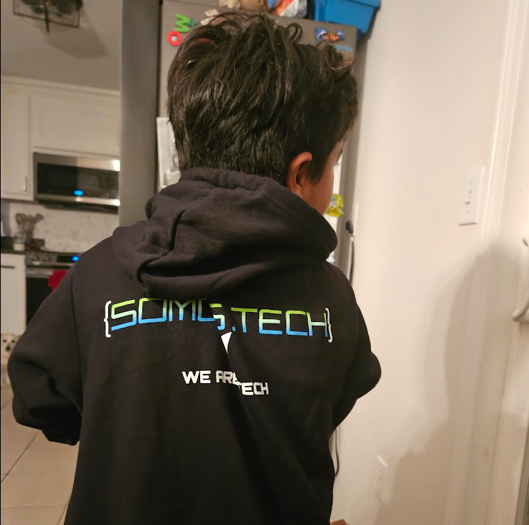
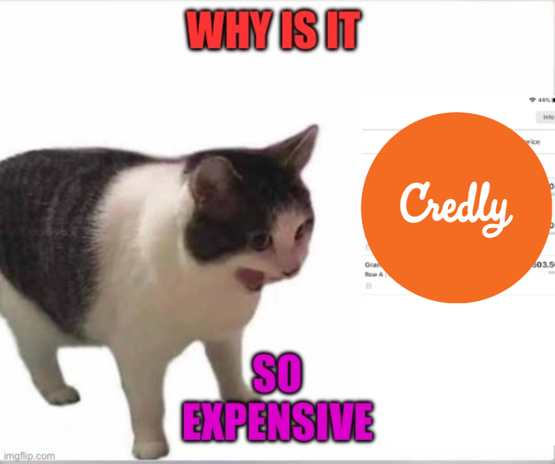
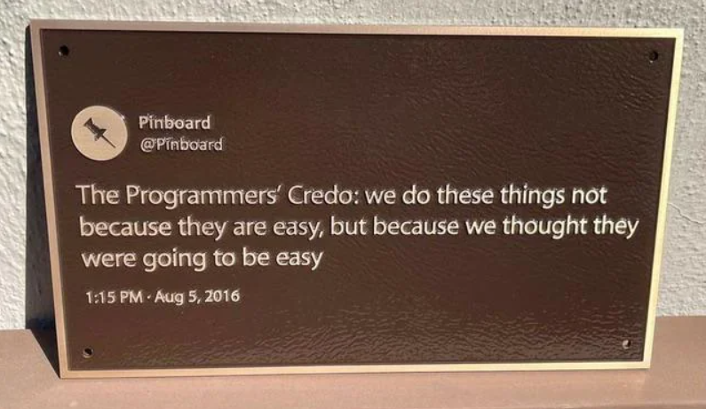
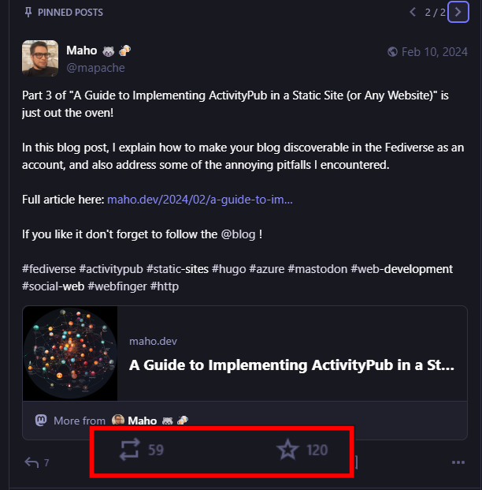
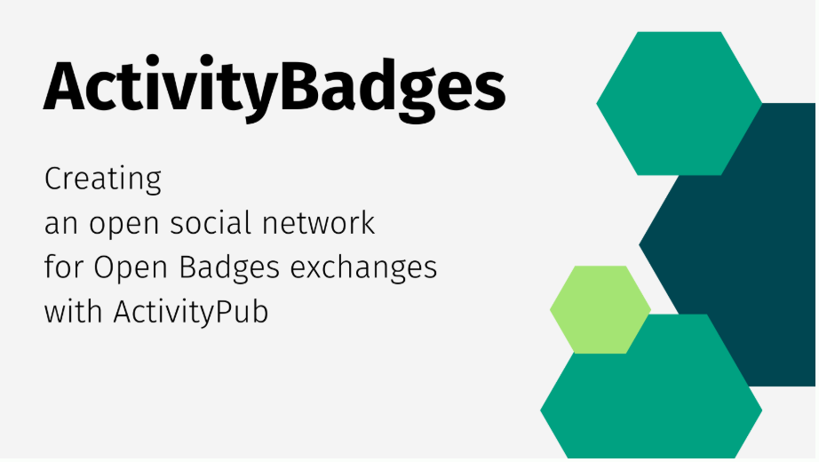
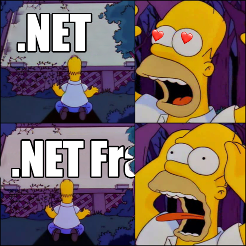
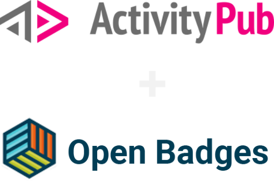
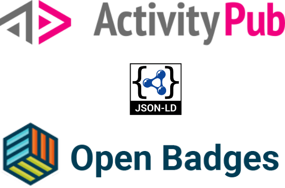

<style>
:root {  
  --color-prettylights-syntax-string: #cee5ffff;
  --color-prettylights-syntax-constant: #3d98ffff;
}

</style>
<!-- _header: "" -->
<!-- _footer: "" -->


# **Decentralised Badges with ActivityPub + OpenBadges**

## Building the Interoperable Credentialing System We Deserved

**FOSDEM 2026**  

---

<!-- _class: lead -->


---

<!-- _class: lead -->



---

<!-- _class: lead -->


---

<!-- _class: lead -->


---

<!-- _class: lead -->


---

<!-- _class: lead -->


---

<!-- transition: fade -->

<!-- _class: none -->

## My focus as CTO:

- 🌐 Maintaining websites and systems
- 🎯 Content creation for hackathons  
- 🔧 Building community tools (interview simulators, mentorship platforms)
- 🤝 Organizing meetups and conferences with tech industry insiders

-.-

---

<!-- _class: none -->

## My focus as CTO:

- 🌐 Maintaining websites and systems
- 🎯 Content creation for hackathons  
- 🔧 Building community tools (interview simulators, mentorship platforms)
- 🤝 Organizing meetups and conferences with tech industry insiders

**Soon we realized:** All these activities needed **digital recognition**

---

<!-- _transition: none -->
<!-- _class: none -->

# Everyone Deserves Recognition

**Who needed badges?**
- 🎤 **Speakers** at our events deserved acknowledgment
- 🙋 **Volunteers** needed recognition for contributions  
- 💻 **Hackathon participants** required skill verification
- 👥 **Mentors and mentees** earned credentials after tenure completion

---

<!-- _class: lead -->



---

<!-- _class: lead -->



---

<!-- _class: lead -->


---

<!-- _class: lead -->



---

<!-- _class: lead -->



---

<!-- _class: lead -->


---

<!-- _class: lead -->



---

<!-- _class: lead -->


---

<!-- _class: lead -->



---

<!-- _class: lead -->



---

<!-- _class: none -->

```json
{
  "@context": "https://w3id.org/openbadges/v2",
  "type": "Assertion",
  "id": "https://badges.vocalcat.com/openbadge/badgesvocalcatcom_5_8_2f1bbe7477c80c1ff0100c86c31c0289",
  "recipient": {
    "type": "url",
    "identity": "https://hachyderm.io/@mapache",
    "hashed": false
  },
  "badge": {
    "@context": "https://w3id.org/openbadges/v2",
    "type": "BadgeClass",
    "id": "https://badges.vocalcat.com/openbadge/class/8",
    "name": "\uD83D\uDEE0\uFE0F Code Contributor \u2013 Badgefed",
    "description": "You\u0027ve r...",
    "image": "https://badges.vocalcat.com/uploads/badges/addf70b5-ca5e-4d84-8a2b-88c40d6314da.png",
    "criteria": {
      "narrative": "Must have at least 1 merged Pull Request..."
    },
    "issuer": {
      "@context": "https://w3id.org/openbadges/v2",
      "type": "Profile",
      "id": "https://badges.vocalcat.com/openbadge/issuer/badges.vocalcat.com/badgefed",
      "name": "BadgeFed",
      "url": "https://badges.vocalcat.com/actors/badges.vocalcat.com/badgefed",
      "email": "badgefed@badges.vocalcat.com"
    }
  },
  "verification": {
    "type": "hosted"
  },
  "issuedOn": "2025-04-11T17:06:11Z",
  "evidence": [
    {
      "type": "Evidence",
      "id": "https://badges.vocalcat.com/view/grant/badgesvocalcatcom_5_8_2f1bbe7477c80c1ff0100c86c31c0289",
      "narrative": "This badge was issued through BadgeFed, a decentralized badge issuing platform using ActivityPub."
    }
  ]
}
```

---

<!-- _class: none -->

```json
{
  "@context": "https://www.w3.org/ns/activitystreams",
  "id": "https://badges.vocalcat.com/grant/badgesvocalcatcom_72_11_89fb419013f52130e83e223663906b6b",
  "type": "Note",
  "content": "<h1>BadgeFed Unconfe...",
  "url": "https://badges.vocalcat.com/grant/badgesvocalcatcom_72_11_89fb419013f52130e83e223663906b6b",
  "attributedTo": "https://badges.vocalcat.com/actors/badges.vocalcat.com/badgefed", <--- 
  "attachment": [
    {
        "@context": "https://w3id.org/openbadges/v2",
        "type": "Assertion",
        "id": "https://badges.vocalcat.com/grant/badgesvocalcatcom_72_11_89fb419013f52130e83e223663906b6b/assertion",
        ...
        "issuer": {
          "@context": "https://w3id.org/openbadges/v2",
          "type": "Profile",
          "id": "https://badges.vocalcat.com/openbadge/issuer/badges.vocalcat.com/badgefed", 
          "name": "BadgeFed",
          "url": "https://badges.vocalcat.com/actors/badges.vocalcat.com/badgefed", <--- 
          "email": "badgefed@badges.vocalcat.com"
        }
    }
  ],
  "to": [
    "https://www.w3.org/ns/activitystreams#Public",
```

---

<!-- _class: none -->

# The Magic: Social Credentials

**Simple approach unlocks tremendous possibilities:**

- 👥 **Issuers can be followed** (Actors + ActivityPub verb)
- 💬 **Badges can be commented on** (Reply)
- 🔄 **Shared/boosted, liked** (Announce, Like)
- 💭 **Even quoted** (Quote)

**We've added all the social dynamics to credentials!**

---

<video src="imgs/socialaspects.mp4" controls width="80%"></video>

---

### When an issuer posts a badge, 
## other issuers receive those notes, 
## and voilà! Decentralized badges.*

---

<video src="imgs/decentralization.mp4" controls width="80%"></video>

---

# Federation: Relays & Networks

**Specialized actors that exclusively boost badges:**

- 🏛️ **University relays** - Educational institutions within countries
- 🎮 **Gaming relays** - Indie game achievements and accomplishments  
- 🏭 **Industry relays** - Professional certifications for specific sectors
- 🏛️ **Government relays** - Regional credential verification
- 🛠️ **Trade networks** - Specialized skills for arts and technical fields

**Result:** Instances can receive, verify, and distribute badges virtually anywhere

---

<video src="imgs/relay.mp4" controls width="80%"></video>

--- 

# Wallet: Owning Your Credentials

**Decentralized credential storage:**
- 📱 **Smartphone app** or self-hosted system
- 🏠 **Your domain, your control**
- 💾 **Persistent copies** even if issuers disappear
- 🔍 **Single verification point** for employers

**Unlike Mozilla Backpack:** Fully decentralized within the fediverse

**The Game Changer:** Any Mastodon user can issue badges using existing APIs

---

<video src="imgs/wallet.mp4" controls width="80%"></video>

--- 

<video src="imgs/somostechbadges.mp4" controls width="80%"></video>

--- 

# Security & Trust: Verification

## **Comprehensive Security Model**

1. **ActivityPub Signatures** - HTTP signatures verify sender authenticity
2. **OpenBadge Signatures** - Cryptographic integrity of badge data 
3. **Actor-Issuer Linking** - Badge issuer URL must match ActivityPub actor

## **Recipient Protection**
- Recipients must be mentioned in ActivityPub Note
- Prevents badge spoofing and misattribution
- Federated identity verification across platforms

---

# How YOU Can Build This Future

## **🛠️ As a Developer**
- **Core Development:** `github.com/tryvocalcat/badgefed`
- **UI/UX:** Build themes and improve user experience  
- **Integrations:** Connect with existing platforms and tools
- **Documentation:** Help others understand and implement
- **API Extensions:** Build new federation capabilities

---

# How YOU Can Build This Future

## **🏛️ As an Organization**
- **Deploy:** Use BadgeFed for your community
- **Join Network:** Connect with Community Credentials
- **Share Stories:** Document your use cases and impact
- **Request Features:** Help shape development priorities

---

## **As a Supporter**
### get your Badge
# badgefed.org/get/fosdem26

---

# Current Challenges: Help Us

- 🔍 **Federation scaling** - Discovery across large networks
- 🔎 **Search & discovery** - Cross-instance badge search
- 🆔 **Identity portability** - Moving credentials between platforms
- 🛡️ **Moderation & trust** - Preventing spam and building reputation

---

# Recognition: Our Future
- 🌐 **Decentralized** - No single point of failure
- 🤝 **Social** - Integrated with how we communicate  
- 👥 **Community-owned** - Controlled by those who matter most

**The question isn't whether this will transform how we think about credentials and achievements, it's whether you'll help build this future with us.**

---


# Thank You!

🌐 **badgefed.org**  
🏛️ **communitycredentials.org**  
🤝 **somos.tech**  
💬 **badgefed.org/get/fosdem26**

---

# Appendix: Quick Start Guide

## **One-Command Deploy**
```bash
# Docker deployment
docker run -d -p 5000:80 badgefed/badgefed

# Visit localhost:5000 and follow setup wizard
```

## **Essential Links**
- **Source Code:** `github.com/tryvocalcat/badgefed`
- **Documentation:** `/docs` folder in repository
- **ActivityPub Spec:** `w3.org/TR/activitypub`
- **Open Badges:** `openbadges.org`
- **Live Demo:** `demo.communitycredentials.org`

## **Community Support**
- **Matrix:** `#badgefed:matrix.org`
- **Discord:** Link in GitHub README
- **Issues & Feature Requests:** GitHub Issues